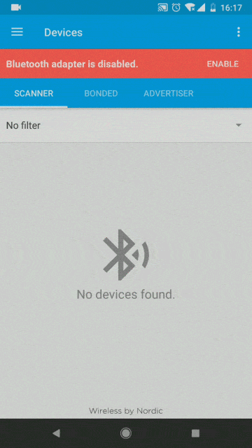
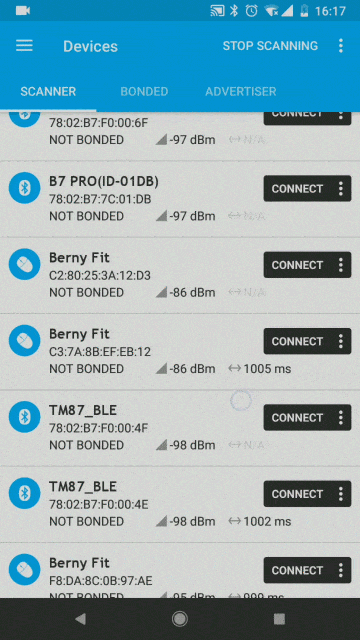
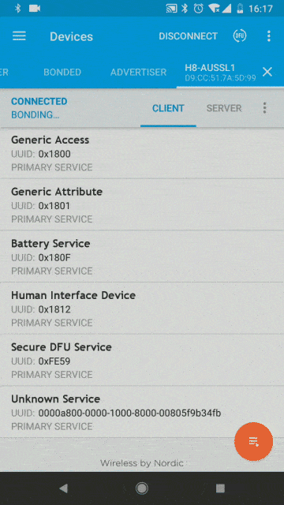
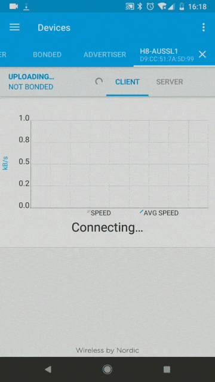
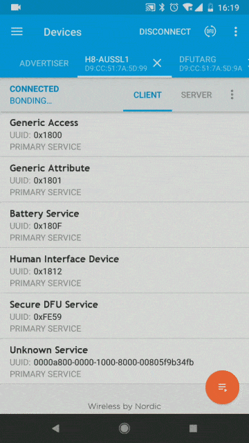

# 使用nrf connect进行DFU空中升级的操作指导(for Android)

在进行DFU升级之前，请先确认在手机中已经准备好`zip`格式的升级包。(注意，请不要将压缩包解压)

## 0. 下载并安装`nrf connect`软件

## 1. 打开软件，搜索设备

- 首先，点击软件图标，打开软件
- 如果出现没有打开蓝牙的提示，点击`enable`自动打开蓝牙
- 点击`scan`按钮，或者在界面中下拉，开始搜索设备
- 找到自己的设备

## 2. 连接设备

- 点击`connect`连接设备

## 3. 点击DFU按钮，并选择升级包

- 点击右上角的`DFU`按钮
- 选择已经准备好的升级包

## 4. 等待升级完成

- 根据系统的不同，升级进度会显示在通知栏，或者如图中所示的另一个`tab`中

## 5. 断开连接，退出软件

- 点击`disconnect`断开连接
- 点击`x`关闭打开的`tab`
- 然后退出软件
- 之后就可以正常的使用客户端`app`来连接设备了

